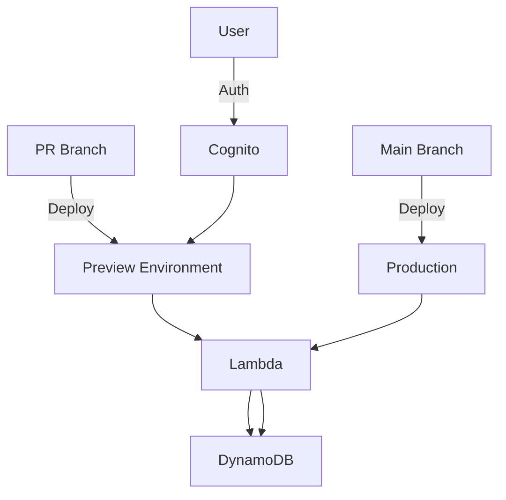

# WishApp Deployment

## Deployment Goals
- **Main branch**: Auto-deploy cargo-lambda app to production
- **PR branches**: Feature deployments protected by Cognito auth
- **Infra changes**: Manual deployments via `cdk deploy`

## Architecture


## Key Commands
```bash
# Development workflow:
npm run build   # Compile TypeScript
npm test        # Run tests
npx cdk deploy  # Deploy changes

# Production deploy (via CI):
npm ci
npm run build
npx cdk deploy --require-approval never
```

## Implementation Details
- PR deployments use branch name in resource IDs
- Cognito auth configured via CDK
- IAM roles follow least privilege principle
- Monitoring via CloudWatch alarms
- Environment config via CDK contexts
