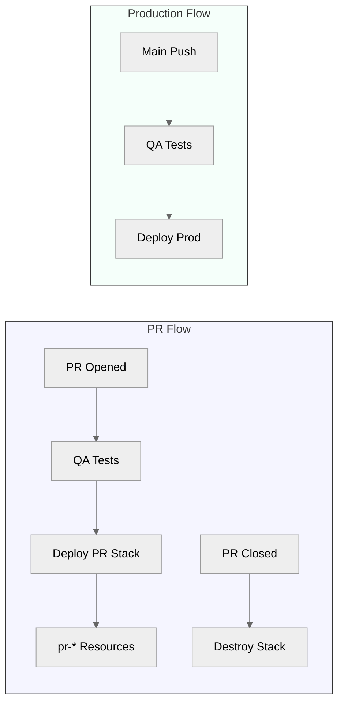
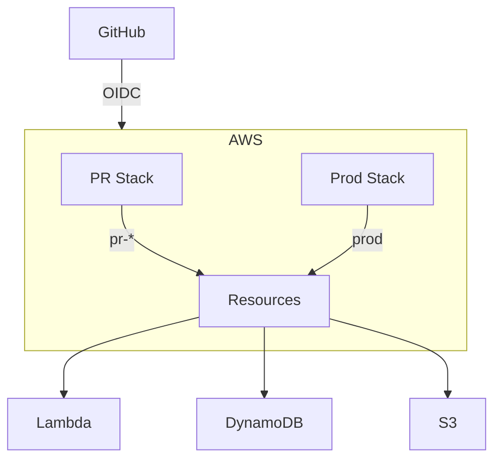
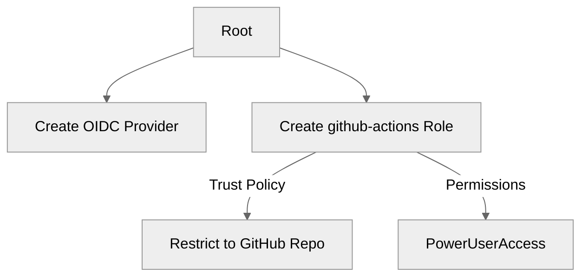
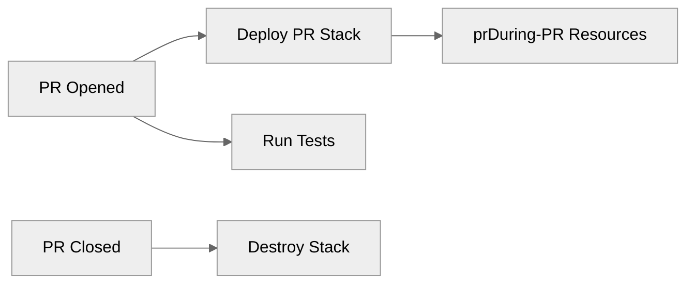
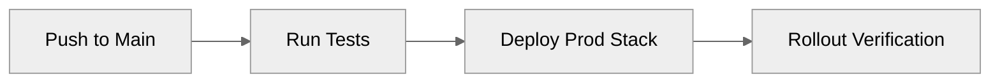

# WishApp Deployment

## Deployment Goals
- **Main branch**: Auto-deploy to production with OIDC auth
- **PR branches**: Isolated stacks with auto-cleanup
- **Security**: GitHub OIDC with zero secrets
- **Cost control**: $10 budget alerts for PR environments

## Deployment Flow


## Architecture


## Key Commands
```bash
# PR Environment (run in CI):
npx cdk deploy -c prNumber=$PR_NUMBER

# Production (run in CI):
npx cdk deploy

# Destroy PR Environment:
npx cdk destroy -c prNumber=$PR_NUMBER

# Local Development:
npm ci
npm test
npx cdk synth
AWS_PROFILE=dev npx cdk deploy
```

## Deployment Flow

### 1. Manual Setup (Root Account)

Run once per account:
```bash
aws iam create-open-id-connect-provider \
  --url https://token.actions.githubusercontent.com \
  --client-id-list sts.amazonaws.com \
  --thumbprint-list 6938fd4d98bab03faadb97b34396831e3780aea1
```

### 2. PR Deployment

- Creates isolated `pr-*` resources
- Auto-destroys when PR closes

### 3. Production Deployment

- Deploys to production account
- Requires main branch push
