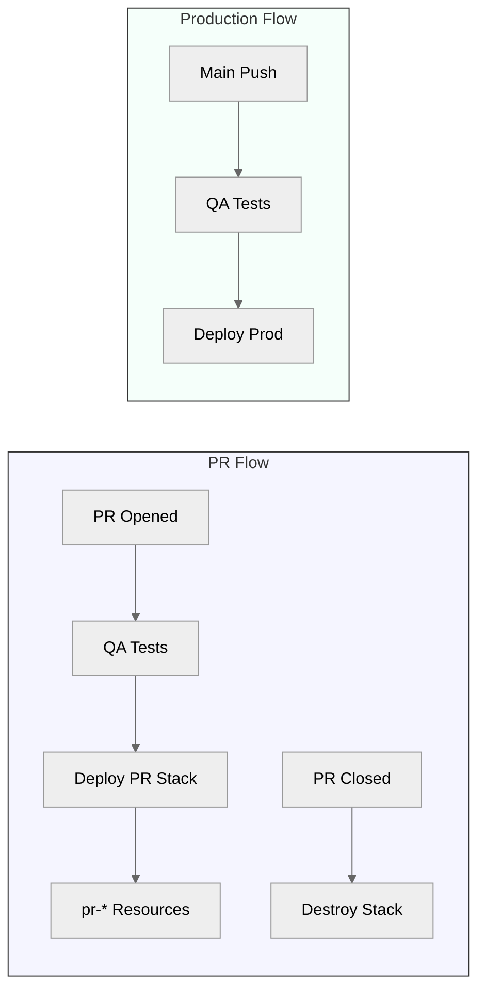
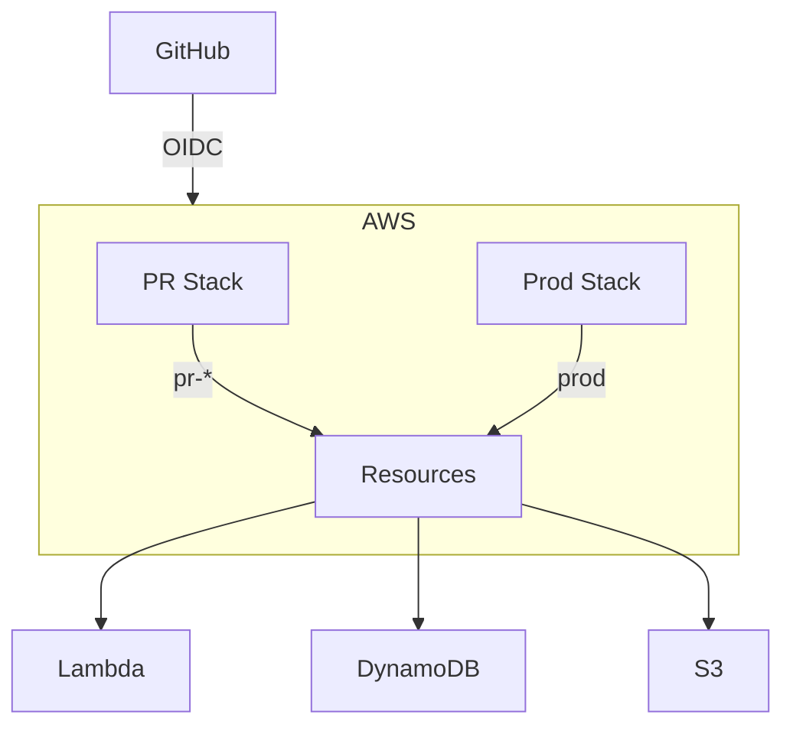

# WishApp Deployment

## Deployment Goals
- **Main branch**: Auto-deploy to production with OIDC auth
- **PR branches**: Isolated stacks with auto-cleanup
- **Security**: GitHub OIDC with zero secrets
- **Cost control**: $10 budget alerts for PR environments

## Deployment Flow


## Architecture


## Key Commands
```bash
# PR Environment (run in CI):
npx cdk deploy -c prNumber=$PR_NUMBER

# Production (run in CI):
npx cdk deploy

# Destroy PR Environment:
npx cdk destroy -c prNumber=$PR_NUMBER

# Local Development:
npm ci
npm test
npx cdk synth
AWS_PROFILE=dev npx cdk deploy
```

## Implementation Details
- **PR Isolation**: `pr-{number}-` prefixed stacks with auto-cleanup
- **Auth**: GitHub OIDC with zero secrets
- **IAM**: Least-privilege roles with PR/prod separation  
- **Cost Control**: $10 budget alerts for PR environments
- **CI/CD**: GitHub Actions with:
  - PR creation/update triggers deployment
  - PR closure triggers destruction
  - Main branch pushes deploy to production
