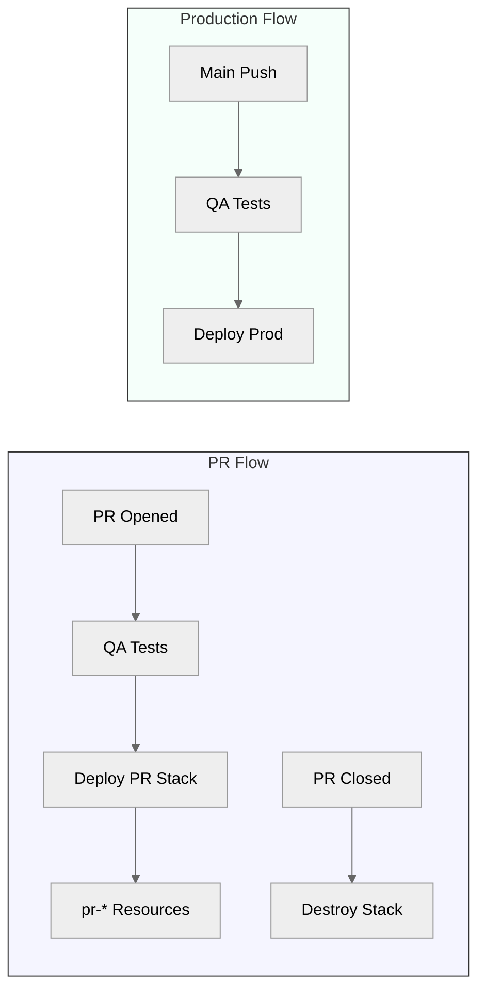
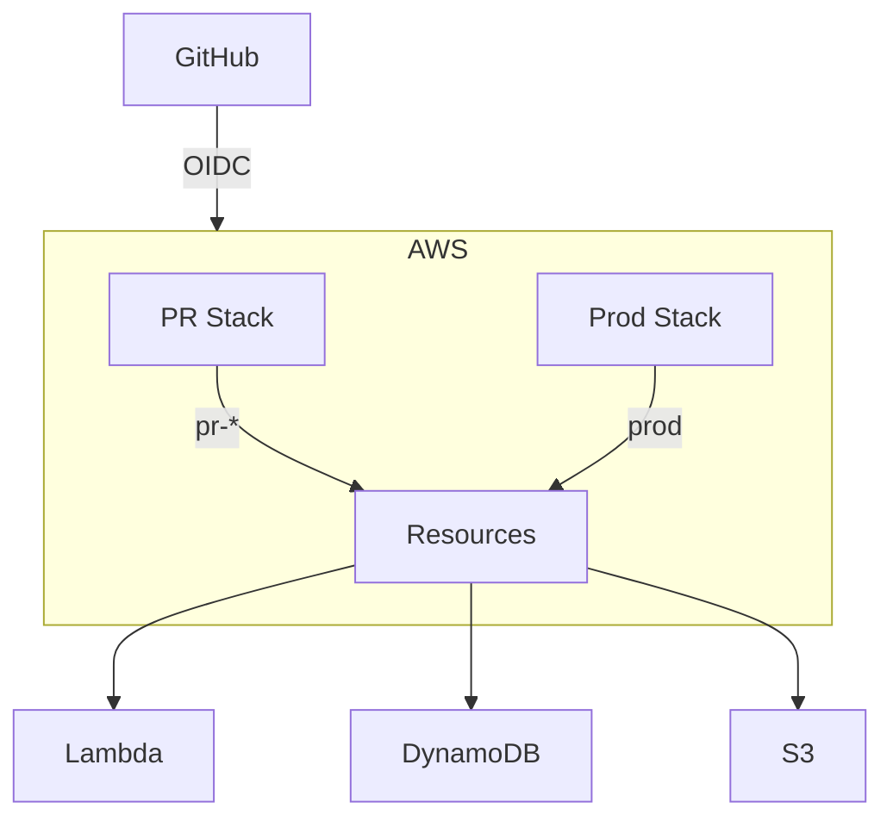
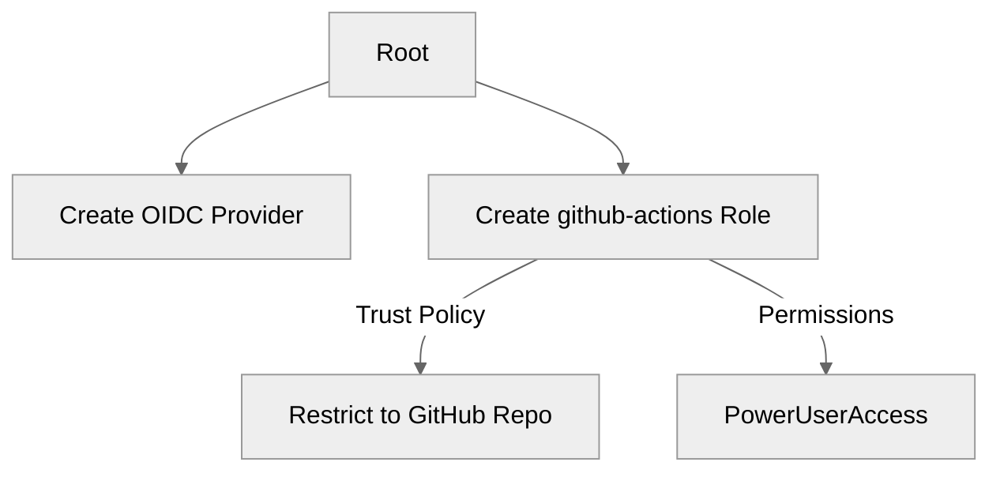
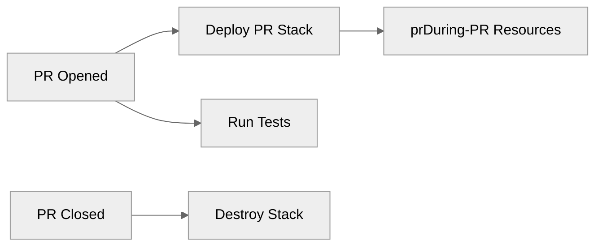
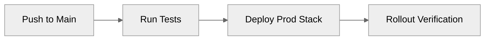

# WishApp Deployment

## Deployment Goals
- **Main branch**: Auto-deploy to production with OIDC auth
- **PR branches**: Isolated stacks with auto-cleanup
- **Security**: GitHub OIDC with zero secrets
- **Cost control**: $10 budget alerts for PR environments

## Deployment Flow


## Architecture


## Deployment Commands

### Initial Setup (One-Time)
```bash
# Install dependencies
npm ci

# Bootstrap AWS accounts (dev/prod)
npx cdk bootstrap aws://DEV-ACCOUNT/REGION \
  --trust ACCOUNT_ID \
  --cloudformation-execution-policies arn:aws:iam::aws:policy/AdministratorAccess

npx cdk bootstrap aws://PROD-ACCOUNT/REGION \
  --trust ACCOUNT_ID \
  --cloudformation-execution-policies arn:aws:iam::aws:policy/AdministratorAccess
```

### Manual OIDC Setup (Root Account)
```bash
# Create GitHub OIDC provider (one-time)
aws iam create-open-id-connect-provider \
  --url https://token.actions.githubusercontent.com \
  --client-id-list sts.amazonaws.com \
  --thumbprint-list 6938fd4d98bab03faadb97b34396831e3780aea1
```

### CI/CD Commands
```bash
# PR Environment Deployment
PR_NUMBER=123 REPO_NAME=morgaesis/wishapp
npx cdk deploy -c prNumber=$PR_NUMBER -c githubRepo=$REPO_NAME

# Production Deployment
REPO_NAME=morgaesis/wishapp
npx cdk deploy -c githubRepo=$REPO_NAME

# Destroy PR Stack
npx cdk destroy -c prNumber=$PR_NUMBER
```

### Local Development
```bash
# Synthesize CloudFormation template
npx cdk synth

# Deploy to dev account
AWS_PROFILE=dev npx cdk deploy

# Run tests
npm test

# View deployment outputs
npx cdk list
npx cdk deploy --outputs-file outputs.json
```

### Cost Monitoring
```bash
# Set budget alerts (run once per account)
aws budgets create-budget \
  --account-id $ACCOUNT_ID \
  --budget file://budgets/pr-budget.json \
  --notifications-with-subscribers file://budgets/notifications.json
```

## Deployment Flow

### 1. Manual Setup (Root Account)

### Complete Manual Setup
1. Create OIDC provider (one-time):
```bash
aws iam create-open-id-connect-provider \
  --url https://token.actions.githubusercontent.com \
  --client-id-list sts.amazonaws.com \
  --thumbprint-list 6938fd4d98bab03faadb97b34396831e3780aea1
```

2. Bootstrap CDK in each target account:
```bash
npx cdk bootstrap aws://ACCOUNT-NUMBER/REGION \
  --cloudformation-execution-policies arn:aws:iam::aws:policy/AdministratorAccess
```

### CI/CD Commands
PR Environment:
```bash
npx cdk deploy -c prNumber=$PR_NUMBER -c githubRepo=$REPO_NAME
```

Production:
```bash
npx cdk deploy -c githubRepo=$REPO_NAME
```

### Cleanup Commands
Destroy PR stack:
```bash
npx cdk destroy -c prNumber=$PR_NUMBER
```

### 2. PR Deployment

- Creates isolated `pr-*` resources
- Auto-destroys when PR closes

### 3. Production Deployment

- Deploys to production account
- Requires main branch push
